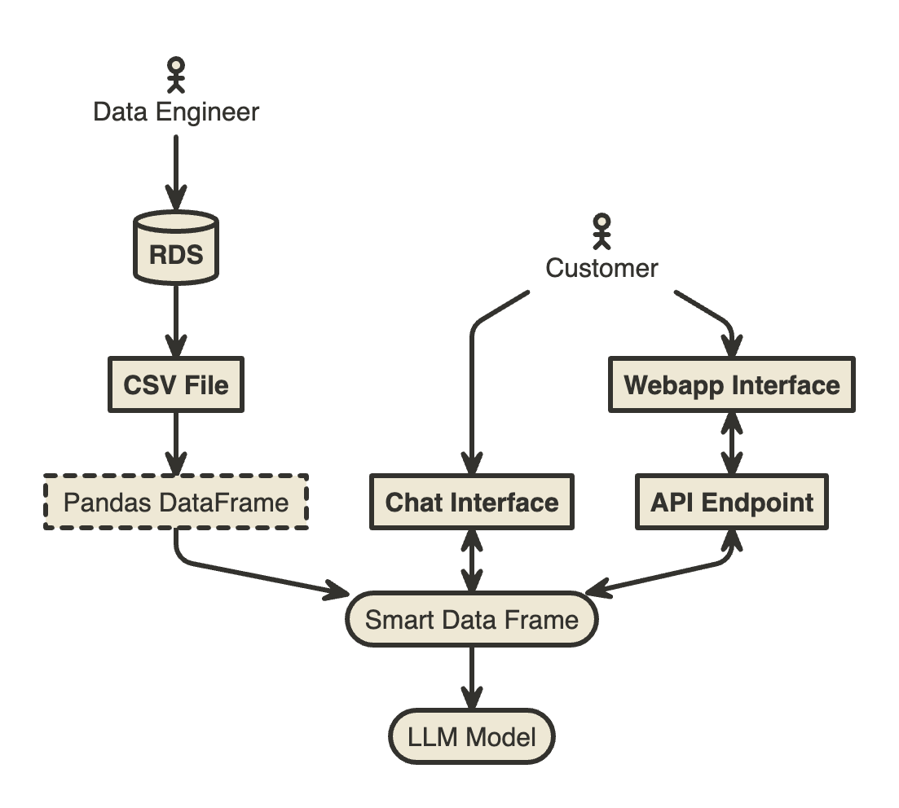

# Eddies Project

Procurement Transaction ChatBot

## Main Workflow



## Virtual Env and Dependencies

```shell
$ python3 -m venv env
$ source env/bin/activate
$ pip install -r requirements.txt
```

## Running Chainlit Interface

```shell
$ chainlit run main [-w]
```

> Use `-w` option for development and keep watching changes in the file

#
3 Running Local Server

```shell
$ python main.py
```

> Connect to the server to 0.0.0.0:8000/query

